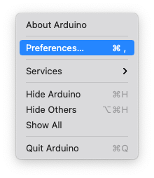

Installing ESP32 Add-on in Arduino IDE
=======================================

1: in your Arduino IDE, go to File>Preference

2: Enter https://raw.githubusercontent.com/espressif/arduino-esp32/gh-pages/package_esp32_index.json into the "Additional Board Manager URLs" field as shown in the figure below. Then click "OK" button.

3: Open the boards Manager. Go to Tools>Board>Boards Manager...

4: Search for ESP32 and Press install button for "ESP32 by Espressif system";

5: It should be installed after a while.

