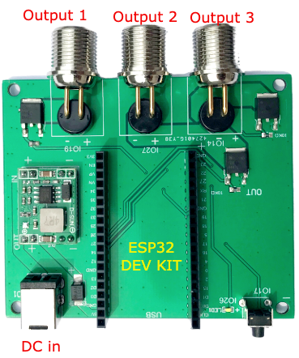

PWM Dimmer
===============
PWM Dimmer works with ESP32-DevKitC. 
You can use it to control at most 3 lights at same time.

* Power: Total 150W
* Input: DC 24V
* Output: 3 Dimmable 24V
* WIFI: 802.n
* Output Terminal: G12-2 aviation connector

.. note::

    ESP32-DevKitC is a low-footprint and entry-level development board that is part of the ESP32 series.
This board has a rich peripheral set. 