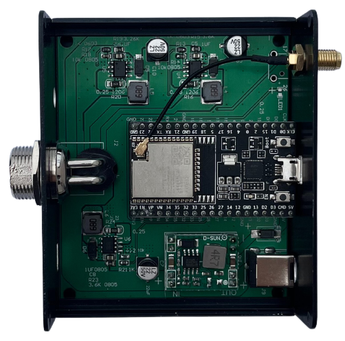

RGB controler 
===============

RGB controler works with ESP32-DevKitC. 
You can use it to control 1 RGB lights at same time.

* Power: Total 150W
* Input: DC 24V; 
* Output: Dimmable 24V
* WIFI: 802.n
* Output Terminal: G16-4 aviation connector

.. admonition:: Homespan code sample

    Control and Status GPIO

    ::

        homeSpan.setControlPin(17); // set control button
        homeSpan.setStatusPin(26); // sets LED Pin

    RGB code:

    ::

        new SpanAccessory();                                                          
          new DEV_Identify("CCT2","abap.sale","as better as Possible","50W CCT LED","0.9",0);
          new DEV_CCTLED(19,27); 
          
.. note::

    ESP32-DevKitC is a low-footprint and entry-level development board that is part of the ESP32 series.

