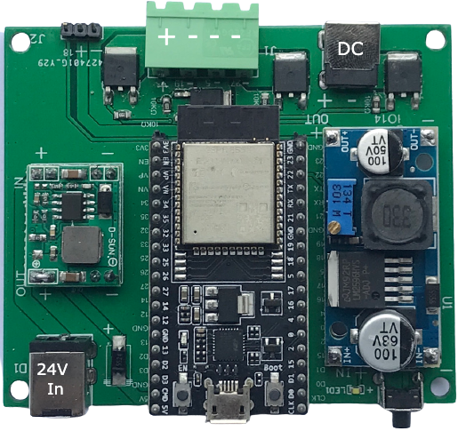

RGB controler 
===============

RGB controler works with ESP32-DevKitC. 
You can use it to control 1 RGB lights at same time.

* Power: Total 150W
* Input: DC 24V; 
* Output: Dimmable 24V
* WIFI: 802.n
* Output Terminal: G16-4 aviation connector

.. note::

    ESP32-DevKitC is a low-footprint and entry-level development board that is part of the ESP32 series.

