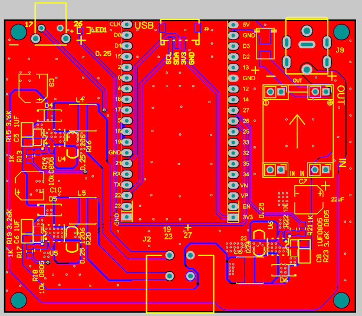
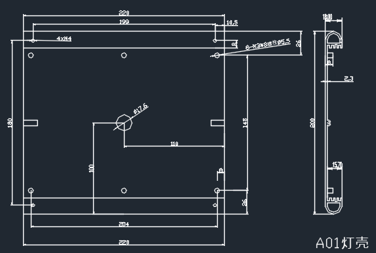

Custom Service
====================

* Electronic Engineering
* Schematic Capture and PCB Layout Design
* Component Selection and Optimization
* System Architecture and Optimization
* Electronics Design Testing and Validation
* Compliance Verification and Certification

Mechanical Engineering

* Design For Manufacturing and Assembly (DFMA)
* Manufacturability/ Sustainability Assessments
* Mechanism Design
* Structural, Thermal and Fluid Analysis

\** Wi-Fi & Bluetooth Connectivity **\

This minimum-system development board is powered by an ESP32 module. It integrates Wi-Fi and Bluetooth functions, and provides a rich peripheral set for rapid prototyping!