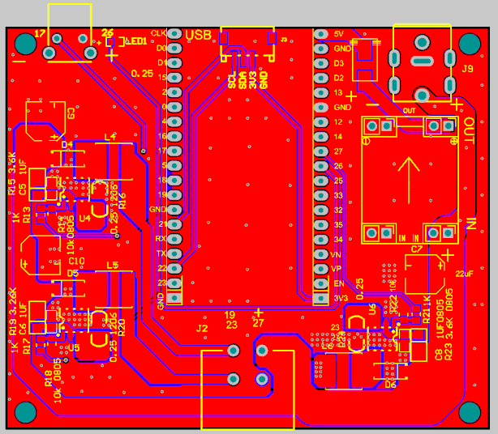
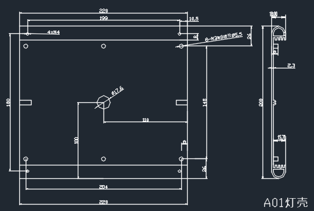

Engineering
====================

Electronic Engineering
------------------------

* Schematic Capture and PCB Layout Design
* Component Selection and Optimization
* System Architecture and Optimization
* Electronics Design Testing and Validation
* Compliance Verification and Certification

Mechanical Engineering
------------------------

* Design For Manufacturing and Assembly (DFMA)
* Manufacturability/ Sustainability Assessments
* Mechanism Design
* Structural, Thermal and Fluid Analysis

