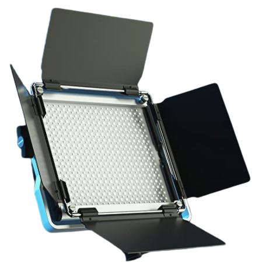

Monochromatic Light
=======================

* Voltage: DC 24V
* Power: 56W
* LED: 320 PCS
* CRI>95
* TCLI>95
* Aviation connector: G12-2
* Color temperature: 5600K

.. note::
    
   It works with our control, If you use constant Current DC ,make sure it is smaller than 2.5A. 
