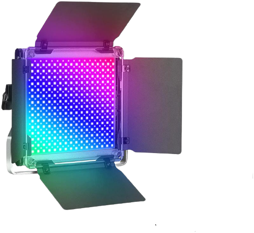

RGB Light
===============================

Shared Positve with three negative

* Using Constant Current Controler
* Power: 50W
* LED: 280 RGB (7S40P)
* Aviation connector: G16-4

.. admonition:: Constent Current Driver

    It works with Constent Current controler. 
    Make sure the current is not above 0.8A for each channel.