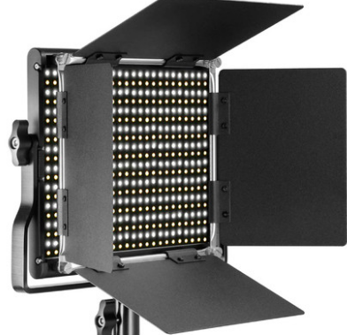

Cold + Warm White Light
=====================================

CCT light has two channels, 
it can be controlled individually or together.

* Voltage: DC 24V
* Power: 56W
* LED: 320 PCS
* CRI>95
* TCLI>95
* Aviation connector G16-3
* Color temperature: 5600K and 3200K

.. note::
    
   It works with our control, If you use constant Current DC ,
   make sure it is smaller than 2.5A. 
